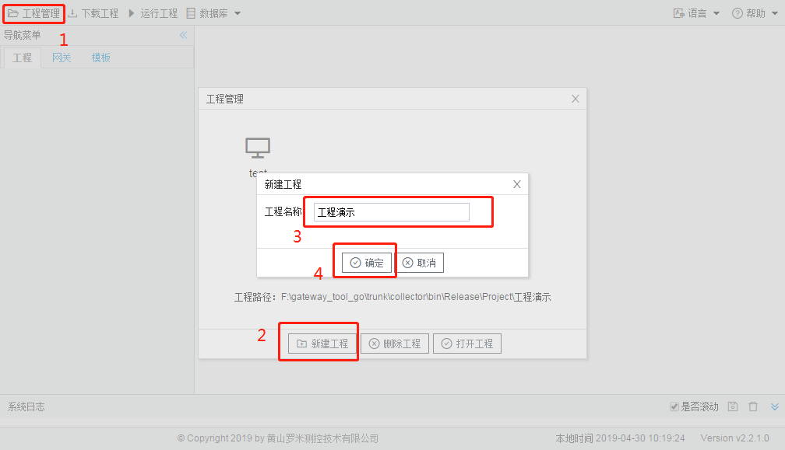
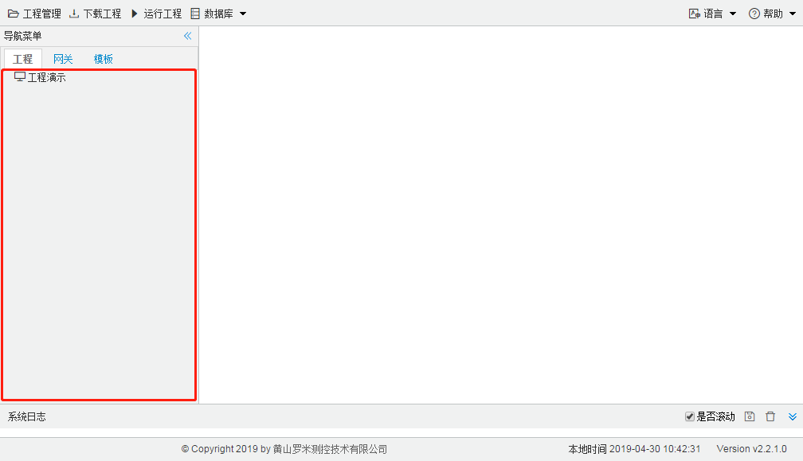
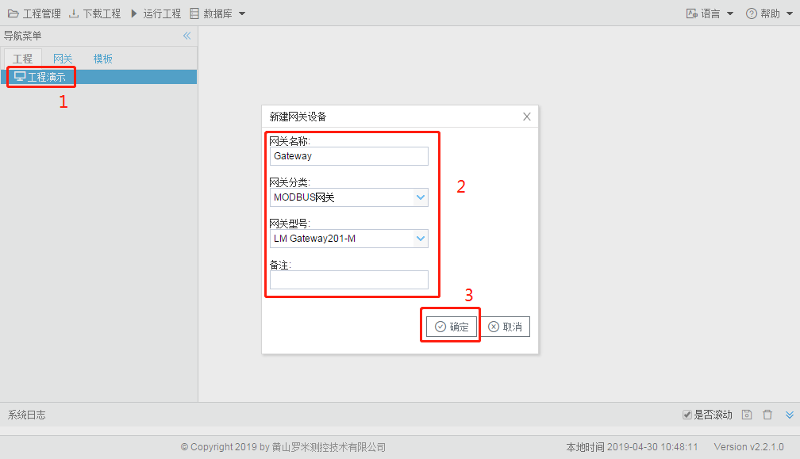
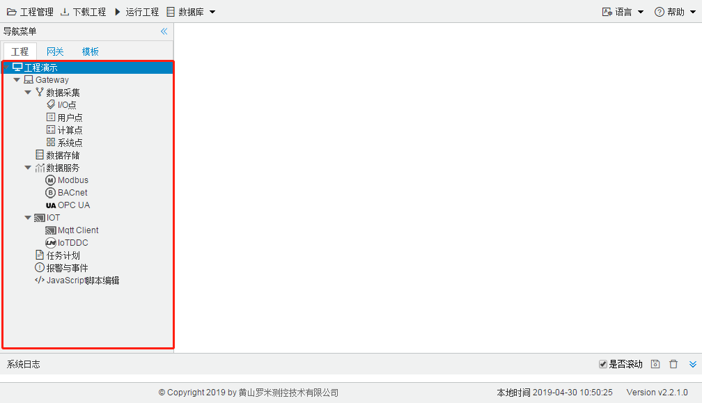

## 1.1 新建工程

在“工程管理”对话框中，单击“新建工程”；在弹出的“新建工程”对话框中，输入工程名称，单击“确定”，操作步骤如图 1-1 所示。 

图1-1 新建工程

工程新建完成以后，会在左侧工程树中显示新建工程的名称作为根节点，之后的工程配置都在此处进行，如图1-2所示。

图1-2 新建工程完成

**添加网关**

单击选中工程树中工程名称节点，右键单击选择“添加网关”，自定义网关名称和备注，选择网关分类和网关型号，具体操作如图1-3所示。 

提示：网关的侧标签有网关型号、网关版本和默认IP等信息。

注意：下载工程到网关时会进行网关型号的验证。

图1-3 添加网关

网关添加完成以后，在工程名称节点下会根据网关型号的不同，显示相应的工程树，如图1-4所示。

图1-4 添加网关完成

